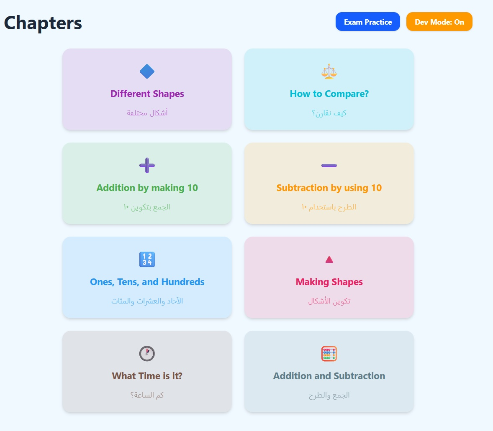
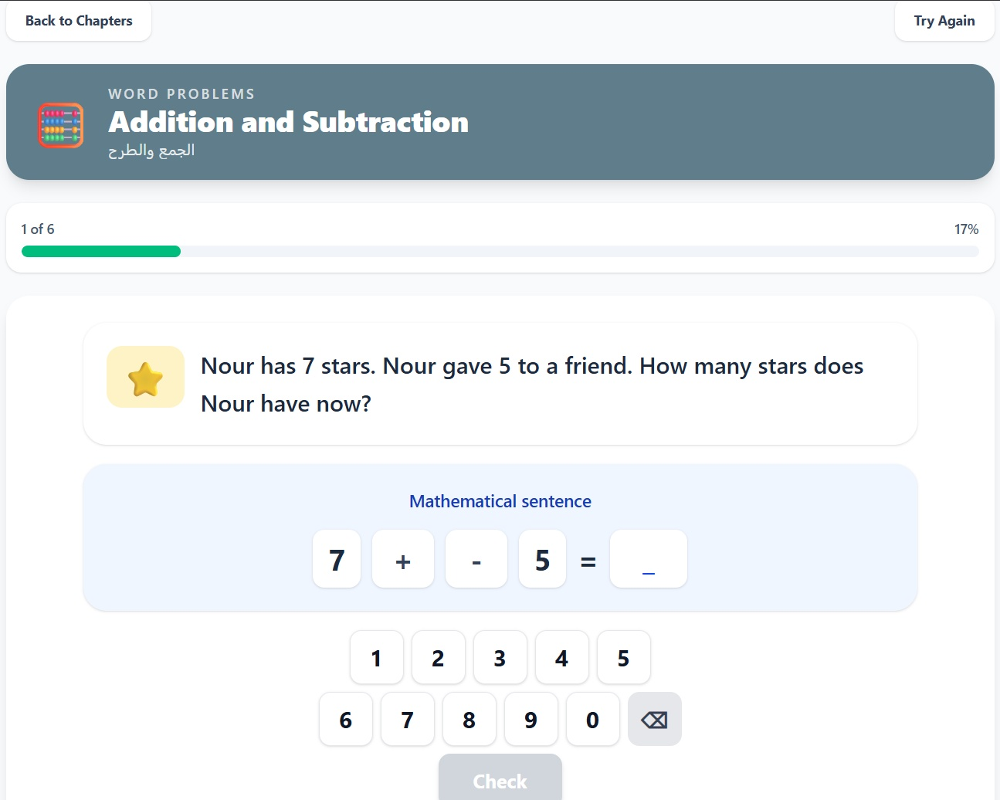
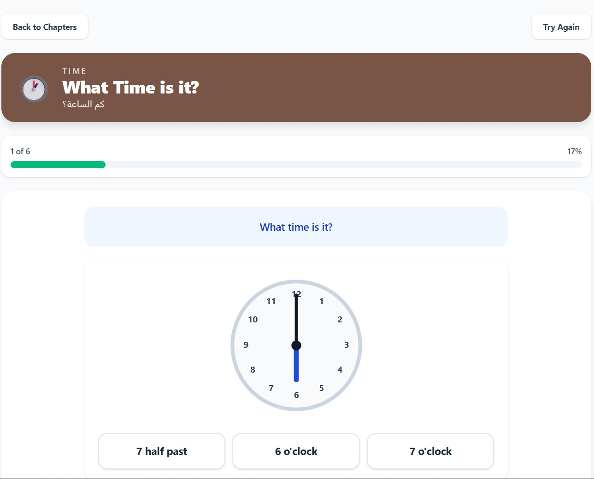

<div align="center">
  <h1>📐 Primary 1 Math</h1>
  <p><strong>Interactive Educational Framework for Egyptian Curriculum</strong></p>
  <a href="https://prime-1-math.vercel.app/">
    
  </a>
</div>

***

## 🎨 Visual Tour

Experience the premium interactive curriculum on any modern tablet or desktop:

<div align="center">
  <h3>Interactive Dashboard</h3>
  
  <p><em>Chapter Map with progress tracking and exam practice shortcuts.</em></p>
  
  <br/>
  
  <table width="100%">
    <tr>
      <td width="50%" align="center">
        
        <p><strong>Guided Logic</strong><br/>Step-by-step word problem solving.</p>
      </td>
      <td width="50%" align="center">
        
        <p><strong>Visual Interaction</strong><br/>Precise analog clock face UI.</p>
      </td>
    </tr>
  </table>
</div>

***


## 🚀 Overview

`Prime Math` is a high-fidelity interactive math application designed for Egyptian Primary 1 students. It transforms legacy textbook-style content (Chapters 10–17) and cumulative assessments into touch-optimized React activities.

### Core Concept: The "Flash-to-React" Bridge
This project acts as an modern engine for legacy educational payloads. It bridges static curriculum data (extracted via NotebookLM and visual audits) into a fluid, animated learning experience using:
- **🚀 LIVE DEPLOYMENT**: [https://prime-1-math.vercel.app/](https://prime-1-math.vercel.app/)
- **Guided Workflows:** Step-by-step interactive solvers for addition and subtraction.
- **Visual Manipulatives:** Digital clocks, base-10 block groupers, and geometric composers.
- **Persistent Progress:** Star-tier scoring and lesson unlocking persisted via `localStorage`.

---

## 📚 Resources

To support student and teacher comprehension, we have provided the following supplementary materials:
- **[Comprehensive Study Guide](docs/STUDY-GUIDE.md):** A structured review of all curriculum concepts (geometry, measurement, and arithmetic).
- **[Curriculum Infographic](docs/Infograph.jpg):** A visual overview of the learning journey.

---

## Run Locally

```bash
npm install
npm run dev
```

Open the local Vite URL shown in the terminal.

## Build

```bash
npm run build
```

## Add Content

Drop or update textbook extraction JSON in the top-level `data/` folder.

Current content sources include:
- `data/chapter_10.json` through `data/chapter_17.json`
- `data/assessments.json`

The app flow is:
1. raw Flash/NotebookLM JSON
2. adapter mapping in `src/lib/adapters/flashDataAdapter.ts`
3. runtime lesson/exam builders
4. `ActivityRenderer`
5. interactive widget

## Tech Stack

- React 19
- TypeScript
- Vite 8
- React Router
- Framer Motion
- dnd-kit
- Tailwind CSS v4
- localStorage persistence

## Main Routes

- `/` splash screen
- `/chapters` chapter map
- `/lesson/:chapterId` lesson flow
- `/exam-practice` exam practice mode

## 📄 Licensing

The **Engine** (UI components, theme, routing, and state management) is licensed under the [MIT License](LICENSE).

The **Payload** (Curriculum data, extracted images, and textbook-specific terminology) located in the `/data` directory is extracted from official educational materials under "fair use" for non-commercial educational purposes, and retains its original copyright by the original publishers.
